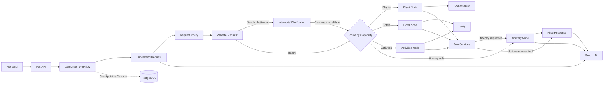

# ✈️ Travora

**Travora** is a LangGraph-based AI travel planner that transforms natural-language travel requests into structured travel plans using capability-based routing, deterministic validation, external travel services, and LLM-powered generation.

[](https://travora-ai-travel-agent.onrender.com)

## Overview

A user can submit requests such as:

> Plan a 7-day trip to Japan from Greece including flights, hotels and sightseeing under 3000$.

or more focused requests such as:

> Find budget hotels in Milan under $120 per night.

Travora first converts the natural-language request into a structured travel request. It then applies deterministic business rules, validates required information, and routes execution only to the capabilities required by that request.

```text
User Request
    ↓
Structured Request Understanding
    ↓
Deterministic Request Policy
    ↓
Request Validation
    ↓
Capability Routing
    ├── Flights
    ├── Hotels
    ├── Activities
    └── Itinerary
    ↓
Final Response
```

If required information is missing or cannot be resolved, the workflow pauses using a LangGraph interrupt and resumes after the user provides clarification.

---

## Features

- 🧠 Structured natural-language request understanding with Pydantic models
- 🧭 Capability-based LangGraph routing
- ✅ Deterministic request policy and validation
- ✈️ Flight information using AviationStack
- 🏨 Hotel research using Tavily
- 🗺️ Destination and activity research using Tavily
- 🤖 LLM-powered itinerary generation using Groq
- 🔀 Conditional execution of only the required travel capabilities
- ⚡ Parallel execution of independent research nodes when applicable
- 💬 Human-in-the-loop clarification using LangGraph interrupts
- 💾 PostgreSQL-backed LangGraph checkpoint persistence
- 🔁 Interrupt/resume workflow support through `thread_id`
- 🌐 FastAPI backend
- 🎨 Responsive browser-based frontend
- 📋 Copy generated travel plans
- 📄 Export travel plans as PDF
- 🔍 LangSmith tracing for workflow inspection and observability

---

## Tech Stack

### AI / Backend

- Python
- LangGraph
- LangChain
- Groq
- FastAPI
- Pydantic

### External Services

- Tavily Search API
- AviationStack API
- PostgreSQL
- LangSmith

### Frontend

- HTML
- CSS
- JavaScript
- Marked.js
- html2pdf.js

### Development

- `uv` for Python environment and dependency management
- Pytest
- Git / GitHub
- VS Code

---

## Architecture

Travora uses a capability-oriented LangGraph workflow.



The workflow separates probabilistic LLM reasoning from deterministic application logic:

```text
Natural-language request
        ↓
LLM structured extraction
        ↓
TravelRequest
        ↓
Deterministic request policy
        ↓
Deterministic validation
        ↓
Conditional LangGraph routing
        ↓
External services / LLM generation
```

This prevents external APIs from being called simply because they exist in the graph. A hotel-only request, for example, does not execute the flight integration.

---

## Workflow Components

### Understand Request

The request-understanding node uses Groq structured output to convert the user's natural-language request into a typed `TravelRequest`.

The model extracts information such as:

- requested capabilities
- origin
- destination
- trip duration
- budget
- number of travelers
- travel preferences

The LLM does not resolve airport codes or validate locations.

---

### Request Policy

After LLM extraction, deterministic business rules normalize the request.

For example, an end-to-end planning request containing both an origin and destination requires:

```text
FLIGHTS
HOTELS
ITINERARY
```

This provides a deterministic safety layer instead of relying entirely on probabilistic LLM classification.

---

### Request Validation

The validation layer checks whether enough information exists to safely execute the requested capabilities.

Flight requests require resolvable origin and destination locations.

Location resolution is deterministic and supports:

- IATA codes
- cities
- countries

If a location such as `"my city"` cannot be resolved, the request is marked as requiring clarification rather than silently guessing a departure airport.

---

### Flight Node

The flight node receives validated IATA airport codes and queries AviationStack directly.

```text
TravelRequest
    ↓
Location Resolution
    ↓
ATH → NRT
    ↓
AviationStack
```

Natural-language route parsing is not performed inside the active flight workflow.

AviationStack currently provides flight/status information rather than live airfare pricing.

---

### Hotel Node

The hotel node constructs a search query from the structured request and retrieves hotel-related web results through Tavily.

Budget and preference information can be incorporated into the search query when available.

---

### Activities Node

The activities node retrieves sightseeing, attractions, and destination information through Tavily when the request includes the `ACTIVITIES` capability.

---

### Join Services

Flight, hotel, and activity retrieval can execute independently.

The `join_services` node acts as a synchronization point before the workflow continues to itinerary generation or the final response.

---

### Itinerary Node

The itinerary node uses the structured travel request together with available flight, hotel, and activity research to generate a practical day-by-day plan using Groq.

---

### Final Response Node

The final response node creates the user-facing answer from the capabilities and results relevant to the current request.

A hotel-only request therefore produces a hotel-focused answer rather than forcing flight or itinerary sections into every response.

---

## Thread and Checkpoint Lifecycle

LangGraph checkpoints are persisted in PostgreSQL and associated with a `thread_id`.

A thread represents a single planning workflow, not a permanent user identity.

Current lifecycle:

```text
New independent request
    ↓
New thread

Clarification required
    ↓
Keep thread

Clarification response
    ↓
Resume same thread

Workflow completed
    ↓
Thread considered closed

Next independent request
    ↓
New thread
```

Completed checkpoints remain persisted in PostgreSQL, but their state is not reused for unrelated planning requests.

This prevents previous trip state and messages from leaking into a new planning session.

---

## Main Files

`app.py`  
FastAPI application, HTTP endpoints, and API response handling.

`backend.py`  
LangGraph construction, LLM configuration, PostgreSQL checkpointing, and workflow execution/resume logic.

`pydantic_models/travel_request.py`  
Typed travel request models, request validation result models, and capability definitions.

`llm/request_parser.py`  
Structured LLM request extraction using Groq and Pydantic.

`services/request_policy.py`  
Deterministic business rules applied after LLM request extraction.

`services/location_resolver.py`  
Deterministic city, country, and IATA airport resolution.

`validation/request_check.py`  
Checks whether a structured request contains enough valid information for execution.

`workflow/state.py`  
Defines the LangGraph `TravelState`.

`workflow/routing.py`  
Contains deterministic conditional-routing logic.

`workflow/nodes.py`  
Contains the workflow node implementations.

`tools/flight_tool.py`  
AviationStack integration for retrieving flight information using resolved airport codes.

`tools/tavily_tool.py`  
Tavily search integration used for hotel and activity research.

`templates/index.html`  
Main frontend page.

`static/script.js`  
Frontend interaction, API requests, clarification thread handling, Markdown rendering, copy functionality, and PDF export.

---

## Setup

### 1. Clone the repository

```bash
git clone <your-repository-url>
cd Travora
```

### 2. Install `uv`

The project uses `uv` for Python environment and dependency management.

If `uv` is not installed:

```bash
pip install uv
```

### 3. Create the virtual environment

```bash
uv venv
```

Activate it on Windows PowerShell:

```powershell
.venv\Scripts\Activate.ps1
```

macOS / Linux:

```bash
source .venv/bin/activate
```

### 4. Install dependencies

```bash
uv sync
```

---

## Environment Variables

Create a `.env` file in the project root:

```env
DATABASE_URL=your_postgresql_connection_string

GROQ_API_KEY=your_groq_api_key

TAVILY_API_KEY=your_tavily_api_key

AVIATIONSTACK_API_KEY=your_aviationstack_api_key
```

Optional LangSmith tracing can be configured through the standard LangSmith environment variables.

Do not commit your `.env` file.

An `.env.example` file can be used as a reference.

---

## Run the Application

Start the FastAPI development server:

```bash
uv run uvicorn app:app --reload
```

Then open:

```text
http://127.0.0.1:8000/
```

---

## Tests

Run the complete test suite:

```bash
uv run python -m pytest -v
```

The test suite currently covers deterministic request validation, location resolution, and request-policy behavior.

For manual inspection of structured request parsing:

```bash
uv run python -m validation.inspect_request_parser
```

---

## Deployment

Travora is containerized with docker and deployed as a Render web service.

The production deployment uses the same FastAPI application and PostgreSQL-backed LangGraph checkpointing.


