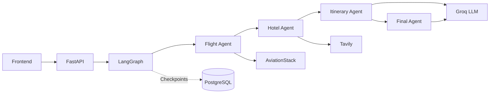

# ✈️ Travora

**Travora** is a LangGraph-based multi-agent travel planner that transforms a natural-language travel request into a complete trip plan including flight information, hotel research, and a day-by-day itinerary.

[](https://travora-ai-travel-agent.onrender.com)

## Overview

A user can submit a request such as:

> Plan a 7-day trip to Japan from Greece including flights, hotels and sightseeing.

Travora processes the request through a LangGraph workflow composed of specialized nodes:

```text
User Request
    ↓
Flight Agent
    ↓
Hotel Agent
    ↓
Itinerary Agent
    ↓
Final Response Agent
    ↓
Travel Plan
```

The workflow combines deterministic external tools with LLM-powered planning and response generation.

---

## Features

- ✈️ Flight information using AviationStack
- 🏨 Hotel and destination research using Tavily
- 🧠 Multi-step orchestration with LangGraph
- 🤖 LLM-powered itinerary generation using Groq
- 📝 Final structured travel-plan generation
- 💾 LangGraph checkpoint persistence with PostgreSQL
- 🌐 FastAPI backend
- 🎨 Responsive browser-based frontend
- 📋 Copy generated travel plans
- 📄 Export travel plans as PDF
- 🔁 Conversation thread persistence through LangGraph `thread_id`

---

## Tech Stack

### AI / Backend

- Python
- LangGraph
- LangChain
- Groq
- FastAPI
- Pydantic

### External Services

- Tavily Search API
- AviationStack API
- PostgreSQL

### Frontend

- HTML
- CSS
- JavaScript
- Marked.js
- html2pdf.js

### Development

- `uv` for Python environment and dependency management
- Git / GitHub
- VS Code

---

## Architecture

Travora follows a multi-step workflow where the frontend sends a travel request to the FastAPI backend, which then runs a LangGraph workflow composed of specialized agents.



LangGraph checkpoints are stored in PostgreSQL and associated with a `thread_id`.

The workflow executes sequentially:

1. Flight research
2. Hotel research
3. Itinerary generation
4. Final response generation

---
## Agent Responsibilities

### Flight Agent

Parses the user's travel request, resolves locations into IATA airport codes, and retrieves live flight information from AviationStack.

This node calls the flight tool deterministically rather than allowing the LLM to choose whether the tool should be executed.

### Hotel Agent

Creates a hotel search query from the user's request and retrieves web results through Tavily.

The Tavily tool is also called deterministically by the graph node.

### Itinerary Agent

Uses the user request together with flight and hotel results to generate a practical travel itinerary through the LLM.

### Final Response Agent

Combines all previous results into a structured final response containing:

- Trip summary
- Flight information
- Hotel suggestions
- Day-by-day itinerary
- Estimated budget
- Final recommendations

---

### Main Files

`app.py`  
FastAPI application and HTTP endpoints.

`backend.py`  
LangGraph state, nodes, graph construction, PostgreSQL checkpointing, and workflow execution.

`tools/flight_tool.py`  
Flight route parsing, airport resolution, and AviationStack integration.

`tools/tavily_tool.py`  
Tavily web-search integration used for hotel research.

`templates/index.html`  
Main frontend page.

`static/script.js`  
Frontend interaction, API requests, thread persistence, Markdown rendering, copy functionality, and PDF export.

---

## Setup

### 1. Clone the repository

```bash
git clone <your-repository-url>
cd Travora
```

### 2. Install Python

The project is managed using `uv`.

If `uv` is not installed:

```bash
pip install uv
```

### 3. Create the virtual environment

```bash
uv venv
```

Activate it on Windows PowerShell:

```powershell
.venv\Scripts\Activate.ps1
```

macOS / Linux:

```bash
source .venv/bin/activate
```

### 4. Install dependencies

```bash
uv sync
```

---

## Environment Variables

Create a `.env` file in the project root:

```env
DATABASE_URL=your_postgresql_connection_string

GROQ_API_KEY=your_groq_api_key

TAVILY_API_KEY=your_tavily_api_key

AVIATIONSTACK_API_KEY=your_aviationstack_api_key

DEFAULT_ORIGIN_IATA=ATH
```

Do not commit your `.env` file.

An `.env.example` file can be used as a reference.

---

## Run the Application

Start the FastAPI development server:

```bash
uv run uvicorn app:app --reload
```

Then open:

```text
http://127.0.0.1:8000/
```

---

